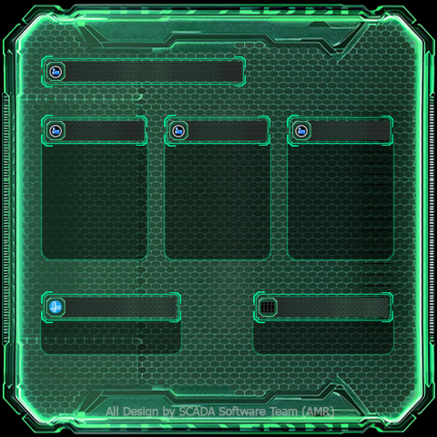

<p align="center">
  
</p>

<h1 align="center">🌊 Waterpump Map - SCADA Visualization System</h1>

<p align="center">
  <strong>ระบบ SCADA สำหรับ monitoring สถานีสูบน้ำผ่าน 3D Map แบบ Real-time</strong>
</p>

<p align="center">
  <a href="#features">Features</a> •
  <a href="#installation">Installation</a> •
  <a href="#usage">Usage</a> •
  <a href="#api">API</a> •
  <a href="#configuration">Configuration</a>
</p>

<p align="center">
  
  
  
  
</p>

---

## ✨ Features {#features}

| Feature                      | Description                                             |
| ---------------------------- | ------------------------------------------------------- |
| 🗺️ **3D Map Visualization**  | แผนที่ 3 มิติพร้อม building extrusion ด้วย Mapbox GL JS |
| 📡 **Real-time Monitoring**  | ติดตามสถานะสถานีแบบ real-time ผ่าน WebSocket            |
| 🎮 **Demo Mode**             | โหมดจำลองข้อมูลสำหรับทดสอบโดยไม่ต้องต่ออุปกรณ์จริง      |
| 🔌 **Modbus Integration**    | รองรับการเชื่อมต่อ Modbus TCP/IP กับ PLC จริง           |
| 🎛️ **Control Panel**         | UI สลับโหมดและดูสถานะการเชื่อมต่อ                       |
| 📊 **Multi-Station Support** | รองรับ 6 สถานี: Pump, Valve, Double Valve, Flood Gate   |

---

## 🏗️ Project Structure

```
Waterpump-Map/
├── 📄 index.html              # Main application
├── 📄 README.md
├── 📄 .gitignore
└── 📁 assets/
    ├── 📁 css/
    │   └── style.css          # Main styles
    ├── 📁 image/               # Station background images
    │   ├── image.png
    │   ├── IMG_3893.png
    │   ├── IMG_3894.png
    │   └── IMG_3895.png
    └── 📁 js/
        ├── server.js           # Backend (BACnet/Modbus + Demo)
        ├── script.js           # Frontend client
        ├── package.json
        └── node_modules/
```

---

## 🚀 Installation {#installation}

### Prerequisites

- **Node.js** >= 18.0
- **npm** >= 9.0

### Quick Start

```bash
# Clone repository
git clone https://github.com/GenDevLife/Waterpump-Map.git
cd Waterpump-Map

# Install dependencies
cd assets/js
npm install

# Start server (Demo mode)
npm start
```

---

## 💻 Usage {#usage}

### Running the Server

#### Demo Mode (Default)

```bash
npm start
# or
npm run demo
```

> ℹ️ Demo mode จำลองข้อมูลสถานีแบบ realistic ไม่ต้องเชื่อมต่ออุปกรณ์จริง

#### Modbus Mode

```bash
npm run modbus
```

#### Custom Modbus Configuration

```bash
set MODBUS_HOST=192.168.1.100
set MODBUS_PORT=502
npm run modbus
```

### Viewing the Application

1. เปิด `index.html` ใน browser (Chrome หรือ Firefox แนะนำ)
2. หรือใช้ **Live Server** extension ใน VS Code

---

## 📡 API Reference {#api}

### REST Endpoints

| Method | Endpoint        | Description                     |
| :----: | --------------- | ------------------------------- |
| `GET`  | `/api/status`   | Server status & connection info |
| `GET`  | `/api/mode`     | Current mode (demo/modbus)      |
| `POST` | `/api/mode`     | Switch mode                     |
| `GET`  | `/api/stations` | Station definitions             |

### Examples

```bash
# Get server status
curl http://localhost:3001/api/status

# Switch to Demo mode
curl -X POST http://localhost:3001/api/mode \
  -H "Content-Type: application/json" \
  -d '{"mode":"demo"}'

# Switch to Modbus mode
curl -X POST http://localhost:3001/api/mode \
  -H "Content-Type: application/json" \
  -d '{"mode":"modbus"}'
```

### WebSocket Events

#### Client → Server

| Event          | Payload                        | Description            |
| -------------- | ------------------------------ | ---------------------- |
| `switchMode`   | `{ mode: "demo" \| "modbus" }` | Switch connection mode |
| `setDemoState` | `{ stationId, key, value }`    | Modify demo data       |

#### Server → Client

| Event        | Payload                              | Description              |
| ------------ | ------------------------------------ | ------------------------ |
| `modbusData` | `{ [registerId]: { values, name } }` | Real-time register data  |
| `modeChange` | `{ mode: string }`                   | Mode change notification |

---

## 🏭 Station Types

<table>
<tr>
<td width="50%">

### 💧 Pump Station

- Network Status
- 3 Pumps (Status, Auto/Manual, Overload)
- Water Level
- Door Level

### 🚿 Valve Station

- Network Status
- Valve Status (Open/Close)
- Valve Control (Remote/Local)
- Water Level

</td>
<td width="50%">

### 🔀 Double Valve Station

- Network Status
- 2 Valves (Status + Control)
- Water Level

### 🚧 Flood Gate

- Network Status
- Power Status
- Control Valve
- Overload Alarm
- Door Level & Water Level

</td>
</tr>
</table>

---

## ⚙️ Configuration {#configuration}

### Environment Variables

| Variable          | Default     | Description                       |
| ----------------- | ----------- | --------------------------------- |
| `CONNECTION_MODE` | `demo`      | Initial mode (`demo` or `modbus`) |
| `MODBUS_HOST`     | `127.0.0.1` | Modbus server IP                  |
| `MODBUS_PORT`     | `502`       | Modbus server port                |
| `MODBUS_UNIT_ID`  | `1`         | Modbus unit ID                    |

### Register Mapping

See `STATION_REGISTERS` in `server.js` for complete register mapping documentation.

---

## 🐛 Troubleshooting

<details>
<summary><strong>Server won't start</strong></summary>

```bash
# Check if port 3001 is in use
netstat -ano | findstr :3001

# Kill the process
taskkill /PID <pid> /F
```

</details>

<details>
<summary><strong>Modbus connection failed</strong></summary>

- Verify Modbus server is running
- Check IP address and port configuration
- Server auto-switches to Demo mode after 15 failed retries
</details>

<details>
<summary><strong>WebSocket disconnected</strong></summary>

- Ensure server is running on port 3001
- Check firewall settings
- Try refreshing the browser
</details>

---

## � Changelog

### v1.0.0 (2025-12-10)

- ✨ Initial release
- 🎮 Demo mode with realistic data simulation
- 📡 Modbus TCP/IP integration
- 🗺️ 3D Mapbox visualization
- 🎛️ Control Panel UI for mode switching
- 📊 Support for 6 station types

---

## 🤝 Contributing

Contributions are welcome! Please feel free to submit a Pull Request.

---

## 📝 License

This project is licensed under the **MIT License**.

---

<p align="center">
  Made with ❤️ by <a href="https://github.com/GenDevLife">GenDevLife</a>
</p>
